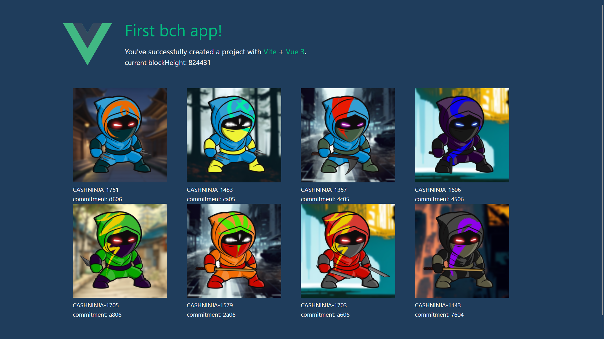

# tutorial-bch-app

This is the Bch-app from the Bitcoin Cash coding [tutorial series on Youtube](https://youtube.com/playlist?list=PL6IWHNFTaMnwEvvV3iPcVqyLgdt0cI1mb&si=DT5cWLDts9kNYEyk).

This tutorial project demonstrates how to build an app with the Vue-Js framework and configure the Vite bundler to work with `mainnet-js`, `libauth` and the `electrum-cash` library.



## How to run the app locally
First clone the project

```sh
git clone git@github.com:mr-zwets/tutorial-bch-app.git
```

Then install the dependencies with
```sh
npm install
```

Finally run the project locally with
```sh
npm run dev
```

## Deployment

To actually compile and minify the application for deployment
```sh
npm run build
```
This will create a `dist` folder with the final assets.
